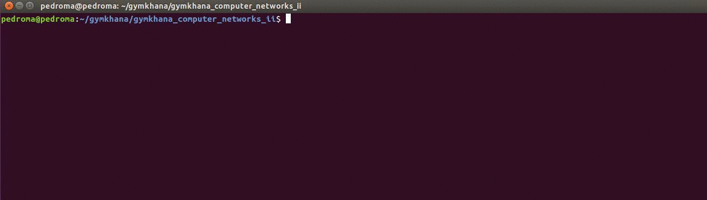

Gymkhana
=========
**Computer Networks II**

***

This project is distributed with educational purpose. Should you wish to execute this program, you must be connected to the UCLM VPN.

Brief explanation of steps:
* Step [**zero**](gymkhana/steps/step0.py) is devoted to perform a basic TCP connection to the UCLM server and retrieve a code.
* Step [**one**](gymkhana/steps/step1.py) is devoted to send through UDP a port number to the server, bind a socket to that port and recieve a code in there.
* Step [**two**](gymkhana/steps/step2.py) is devoted to keep receiving a message through TCP untill it is completed, solve it and send back the solution to the server, repiting that process an undefined number of times.
* Step [**three**](gymkhana/steps/step3.py) is devoted to download a single file through HTTP.
* Step [**four**](gymkhana/steps/step4.py) is devoted to create a correct ping ICMP package, send it to the server and recieve the response.
* Step [**five**](gymkhana/steps/step5.py) is devoted to develop a threading web proxy in order to act as intermediary downloadind files asked by the server and sending them back.

GUI-version running

